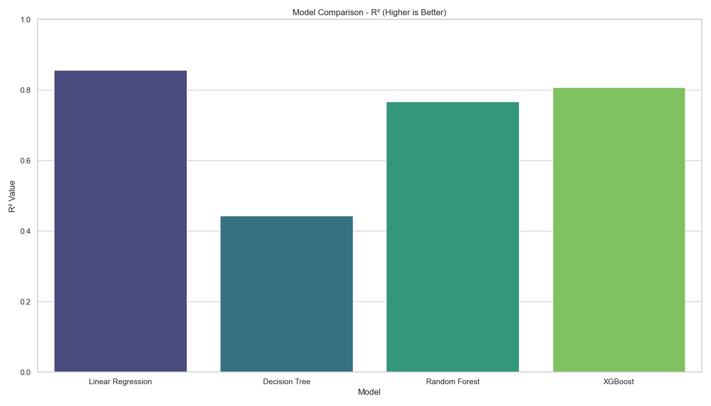
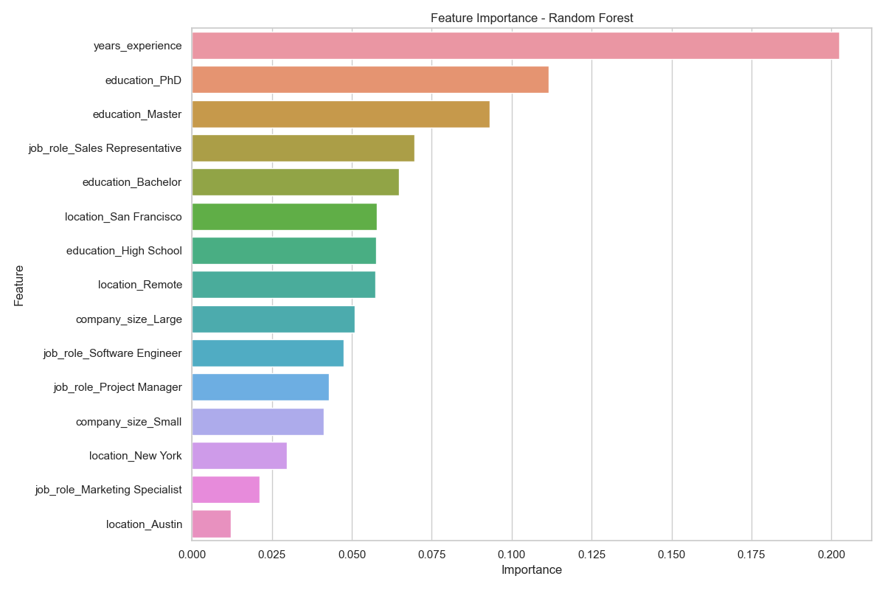
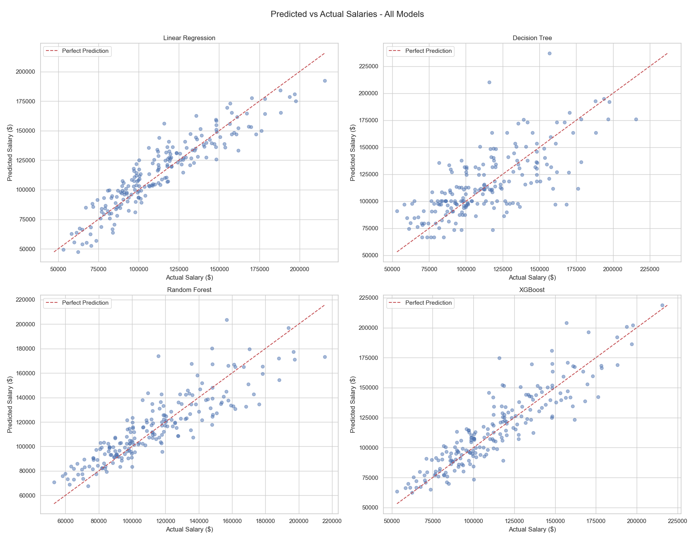

# SalaryScope: Predictive Modeling & Benchmarking with Regression

This project develops and compares multiple regression models to predict salaries based on various features such as education, experience, location, and job role.

## Overview

SalaryScope implements and evaluates four regression models:
- Linear Regression
- Decision Tree Regression
- Random Forest Regression
- XGBoost Regression

Performance is compared using RMSE (Root Mean Squared Error) and R² (Coefficient of Determination) metrics.

## Project Structure

```
salaryscope-regression-model-comparison/
├── data/                 # Dataset directory
│   └── salary_data.csv   # Sample salary dataset
├── notebooks/            # Jupyter notebooks for exploration
│   └── exploratory_analysis.ipynb
├── src/                  # Source code
│   ├── data_processing.py
│   ├── model_training.py
│   ├── model_evaluation.py
│   └── visualization.py
├── main.py               # Main script to run the project
├── requirements.txt      # Project dependencies
└── README.md             # Project documentation
```

## Installation

```bash
# Clone the repository
git clone https://github.com/yourusername/salaryscope-regression-model-comparison.git
cd salaryscope-regression-model-comparison

# Create a virtual environment (optional)
python -m venv venv
source venv/bin/activate  # On Windows: venv\Scripts\activate

# Install dependencies
pip install -r requirements.txt
```

## Usage

```bash
# Run the main script for model training and comparison
python main.py

# Run with specific options
python main.py --samples 2000 --regenerate --save-models

# To generate visualizations only
python src/visualization.py
```

## Results

The project compares model performance using:
- RMSE (Root Mean Squared Error)
- R² (Coefficient of Determination)
- MAE (Mean Absolute Error)
- MAPE (Mean Absolute Percentage Error)

### Model Performance

| Model             |    RMSE |       R² |      MAE |     MAPE |
|:------------------|--------:|---------:|---------:|---------:|
| Linear Regression | 11974.6 | 0.856015 |  9583.45 |  8.87% |
| Decision Tree     | 23527.0 | 0.444186 | 17740.40 | 16.37% |
| Random Forest     | 15224.1 | 0.767265 | 11704.60 | 10.52% |
| XGBoost           | 13826.5 | 0.808035 | 10519.60 |  9.40% |

**Best Model**: Linear Regression achieved the best performance across all metrics for this dataset.

#### R² Comparison



### Feature Importance

The analysis revealed the most important features influencing salary predictions:
- Education level (PhD > Master > Bachelor > High School)
- Years of experience (positive correlation)
- Location (San Francisco and New York command premium)
- Job role (Software Engineer and Project Manager roles typically higher)

#### Random Forest Feature Importance



### Sample Visualizations

The project generates various visualizations including:

1. **Model Comparison**
   - Bar charts comparing RMSE and R² across models
   - Error metrics visualization

2. **Prediction Accuracy**
   - Scatter plots of predicted vs actual salaries for each model
   - Combined comparison visualization

#### Model Predictions Comparison



3. **Feature Analysis**
   - Feature importance plots for tree-based models
   - Feature distribution visualizations
   - Correlation matrix

4. **Data Exploration**
   - Salary distributions by education, job role, location, and company size
   - Experience vs salary relationships

## Dataset

The project uses synthetic salary data with the following features:
- Years of experience (numerical)
- Education level (categorical: High School, Bachelor, Master, PhD)
- Job role (categorical: Data Analyst, Software Engineer, Project Manager, etc.)
- Location (categorical: New York, San Francisco, Chicago, etc.)
- Company size (categorical: Small, Medium, Large)

Target variable:
- Salary (numerical, in USD)

## Future Improvements

- Implement more advanced models (Neural Networks, SVR)
- Feature engineering to extract more insights
- Cross-validation for more robust evaluation
- Hyperparameter tuning to optimize model performance
- Web interface for interactive predictions 